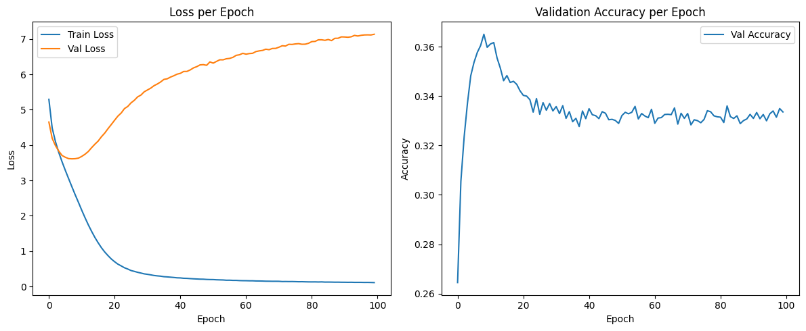

# Attention Is All You Need

Pytorch implementation of Transformer of the paper [Attention Is All You Need](https://arxiv.org/pdf/1706.03762) by Google Research, Brain Team, Aidan N. Gomez, Illia Polosukhin. This paper demonstrates that the Transformer architecture can be applied effectively to domains outside of NLP, such as Computer Vision. This work introduces a pure self-attention architecture—eschewing recurrence and convolutions—and achieves state-of-the-art results on machine translation benchmarks.

## Download spaCy models
```bash
# conda install -c conda-forge spacy
python -m spacy download en_core_web_sm
python -m spacy download de_core_news_sm
```

## The Transformer - Model Architecture

The Transformer model introduces a pure self-attention encoder–decoder architecture. Both encoder and decoder are built by stacking N identical layers. In the encoder, each layer applies multi-head self-attention followed by a position-wise feed-forward network, with residual connections and layer normalization around each sub-layer. Input tokens are first embedded and augmented with fixed positional encodings before entering the encoder stack. The decoder layers are similar but include two attention blocks: a masked multi-head self-attention over the (right-shifted) target embeddings, and a multi-head attention over the encoder outputs, each again followed by a feed-forward network, residual connections, and layer normalization. Finally, decoder outputs pass through a linear projection and softmax to produce output probabilities.


Run `h` attention “heads” in parallel, each projecting `Q, K, V` with its own learnable matrices `W_i^Q, W_i^K, W_i^V`, computing scaled dot-product attention, then concatenating and linearly projecting the results with `W^O`:

```text
MultiHead(Q, K, V)
= [head_1; …; head_h] W^O
where
  head_i = Attention(Q W_i^Q, K W_i^K, V W_i^V)
```

## Parameters

- **src_vocab_size** : int  
  Size of the source‐side vocabulary (number of distinct input tokens).

- **tgt_vocab_size** : int  
  Size of the target‐side vocabulary (number of distinct output tokens).

- **d_model** : int  
  Dimensionality of all token embeddings and hidden representations throughout the model.

- **num_heads** : int  
  Number of parallel attention heads in each multi-head attention block.

- **num_layers** : int  
  Number of stacked encoder layers (and decoder layers).

- **d_ff** : int  
  Inner dimensionality of the position-wise feed-forward network in each block.

- **dropout** : float between 0 and 1  
  Dropout probability applied after attention weights, within feed-forward layers, and on positional encodings.

## Faithful Implementation
- Multi-head self-attention with \(Q, K, V\) projections and scaled dot-product attention  
- Position-wise feed-forward networks (two linear layers with ReLU)  
- Residual connections and layer normalization after each sub-layer  
- Sinusoidal positional encoding added to token embeddings  
- Separate encoder and decoder stacks (6 layers each), with appropriate padding and look-ahead masking in the decoder  
- Token embeddings scaled by \(\sqrt{d_{model}}\) and final linear output layer producing logits over the target vocabulary  

## Key Differences from the Paper
- **Learning Rate Schedule**: Uses a constant learning rate (1e-4) with plain Adam, instead of the warm-up + inverse-square-root decay schedule.  
- **Label Smoothing**: Omits the 0.1 label-smoothing regularization.  
- **Embedding & Output Tying**: Does not tie the input embedding weights to the final linear layer.  
- **Tokenization & Vocabulary**: Uses spaCy word-level tokenization on OPUS-Books data and builds vocab with a min-frequency cutoff, rather than BPE on WMT data.  
- **Dataset & Batch Size**: Trains on the German–English “opus_books” dataset with batch size 32, instead of WMT 2014 with ~25k-word batches.  
- **Beam Search & Inference**: Implements only teacher-forced training; no beam search or greedy decoding routines.  
- **Scheduler & Regularization**: Apart from attention-dropout and residual dropout, no additional regularization (e.g. weight decay) or learning-rate warm-up is applied.  
- **Unused Helper Class**: Includes a single-head `Attention` class for reference but uses only `MultiHeadAttention` in the forward pass.

## Results
The model was trained on the German-English opus_books translation dataset for 3 epochs with a batch size of 32. The model config was used to train the model:
```markdown
```python
config = {
    "src_vocab_size": len(src_vocab),
    "tgt_vocab_size": len(tgt_vocab),
    "d_model": 512,
    "num_hidden_layers": 6,
    "num_attention_heads": 8,
    "intermediate_size": 2048,
    "dropout": 0.1,
    "max_len": 40,
    "batch_size": 32,
    "num_epochs": 3,
    "learning_rate": 1e-4,
    "pad_idx_src": src_vocab["<pad>"],
    "pad_idx_tgt": tgt_vocab["<pad>"],
}

```

## Results

- **Loss:**  
  - Training loss (blue) drops steadily to near zero.  
  - Validation loss (orange) bottoms out around epoch 10 then rises, indicating overfitting.

- **Accuracy:**  
  - Validation accuracy peaks at ~36% around epoch 10.  
  - It then falls back and plateaus near 33%, matching the validation-loss trend.

## Reference
[Attention Is All You Need](https://arxiv.org/pdf/1706.03762), [The Annotated Transformer](https://nlp.seas.harvard.edu/annotated-transformer/#embeddings-and-softmax)
